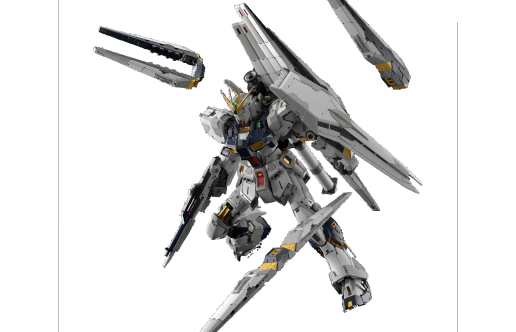
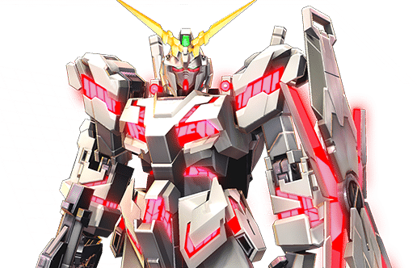
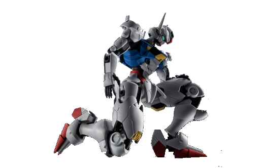
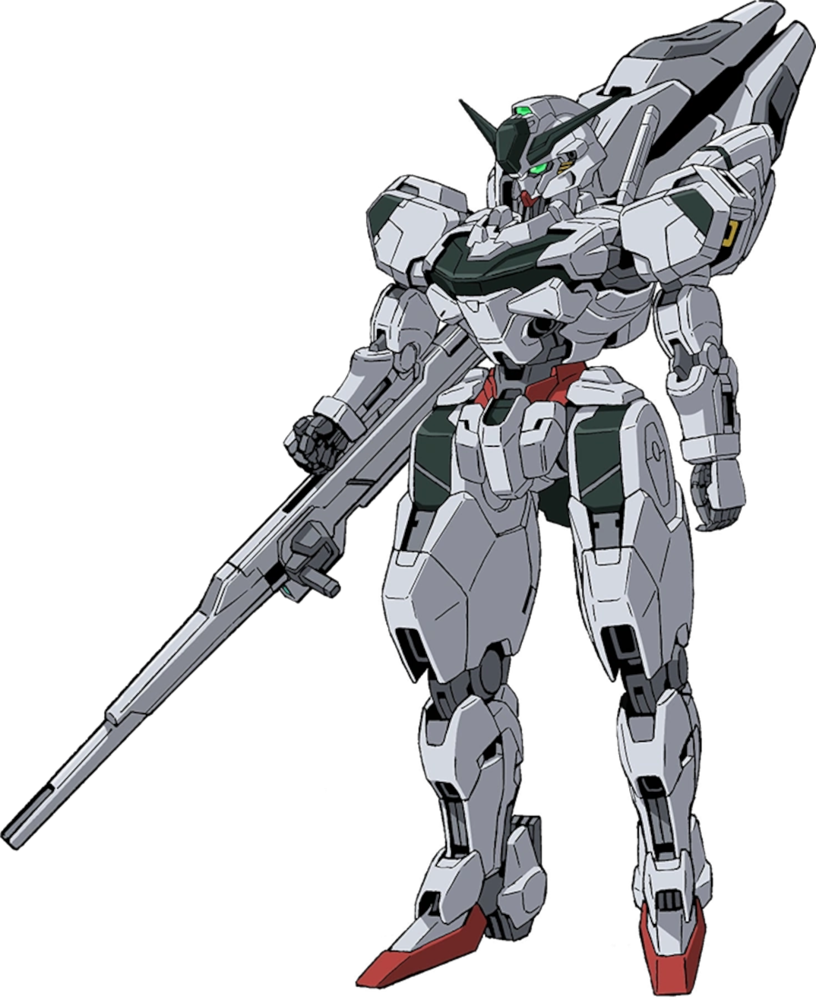
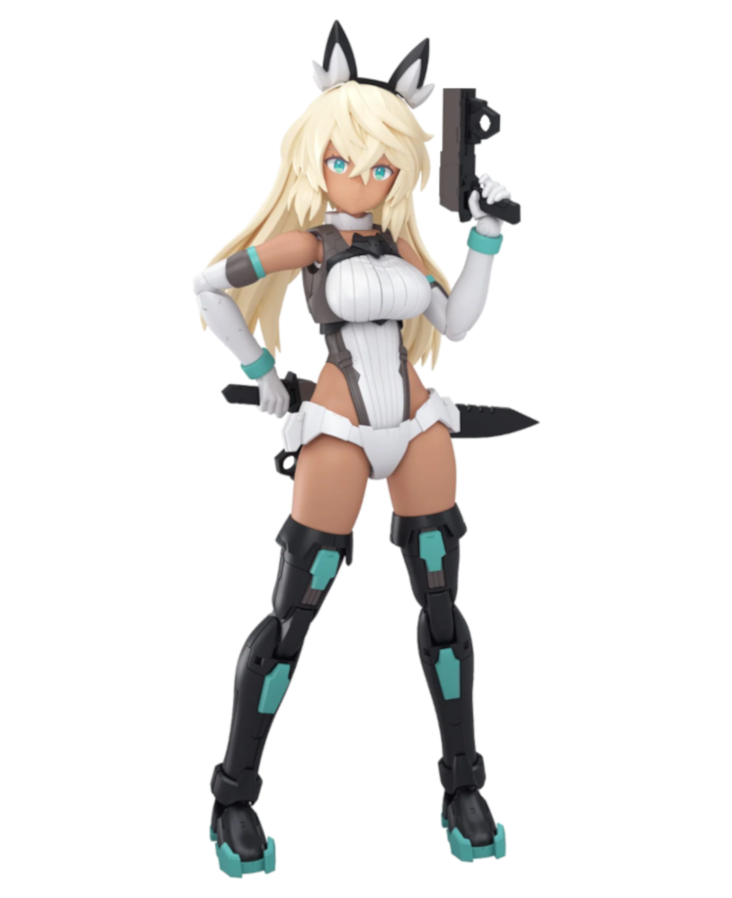
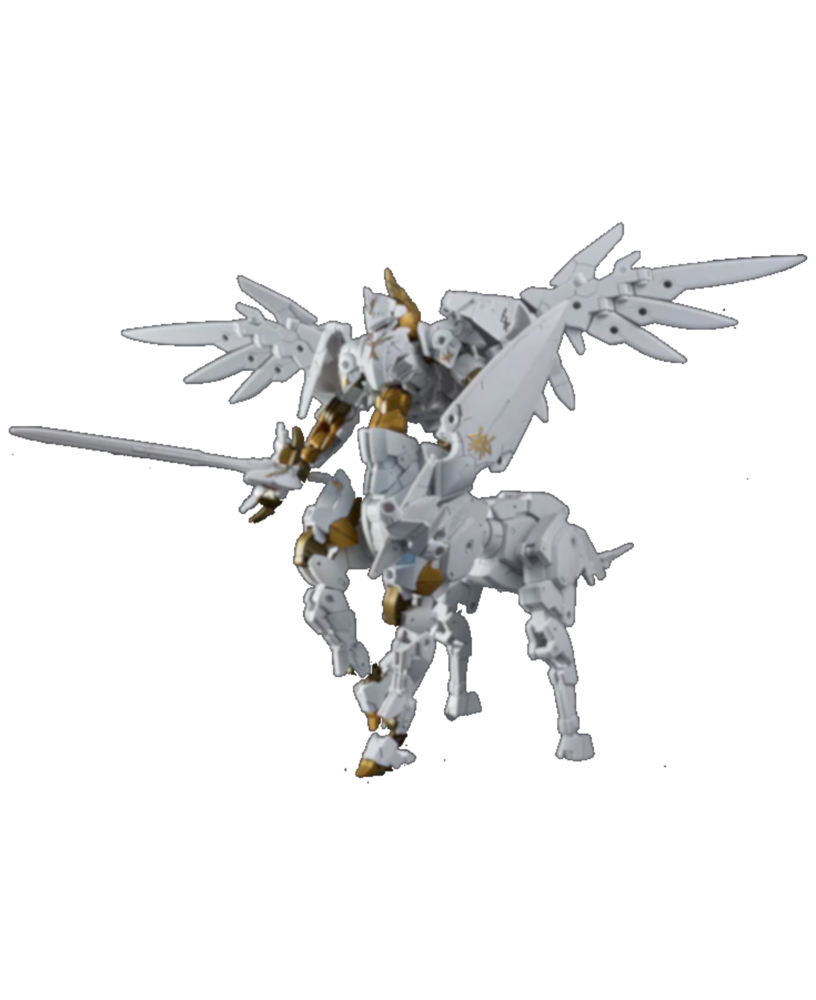

<!DOCTYPE html>
<html lang="en">
  <head>
    <link rel="icon" type="image/x-icon" href="favicon.ico">
    <link rel="stylesheet" href="style.css">
    <title>Sarah's Gunpla Reviews</title>

  </head>
  <body>

    <header id="head">

      <h1>Sarah's Gunpla/Model Kit Reviews</h1>
      <h3><nav><a href=reviews.html>Kit Reviews</a> | <a href=custom.html>Custom Build</a> | <a href="wishlist.html">Wishlist</a></nav></h3>
   
    </header>

    <main>

      

        <h3 id="abtme">About Me</h3>
        

        
        
        
        

        
Hi! My name is Sarah, and I love to build plastic model kits.

        
This site is a repository of personal reviews of some of my favourite model kits from my collection. I have also included articles about my custom builds that I have completed or have planned for the future.

        <h4>Beyond just building the kits, I also:</h4>
        <ul>
          <li>Paint mechanical details on the inner frame</li>
          <li>Panel-line small armor details</li>
          <li>Sand down safety tabs on head V-fins</li>
          <li>3d-print custom stands for posing with accessories</li>
          <li>Paint extra colour details not included on base kit</li>
          <li>Combine kits to make custom builds</li>
        </ul>
      

      
 
        <h3>Pages</h3>
          

            

              <h4><a href=reviews.html>Kit Reviews</a></h4>
              
Some of the best kits from my personal collection.

              
            

            

              <h4><a href=custom.html>Custom Build</a></h4>
              
My latest custom kitbash.

              
            

            

              <h4><a href="wishlist.html">Wishlist</a></h4>
              
Some kits that I want to add to my collection in the future.

              
            
 
          

      

      
    </main>

    <footer>

      

        <h3 id="continf">Contact Info</h3>
        
Email: sarah.perkins@itas.ca 
          © Sarah Perkins 2025
        

      

    </footer>
  </body>
</html>
